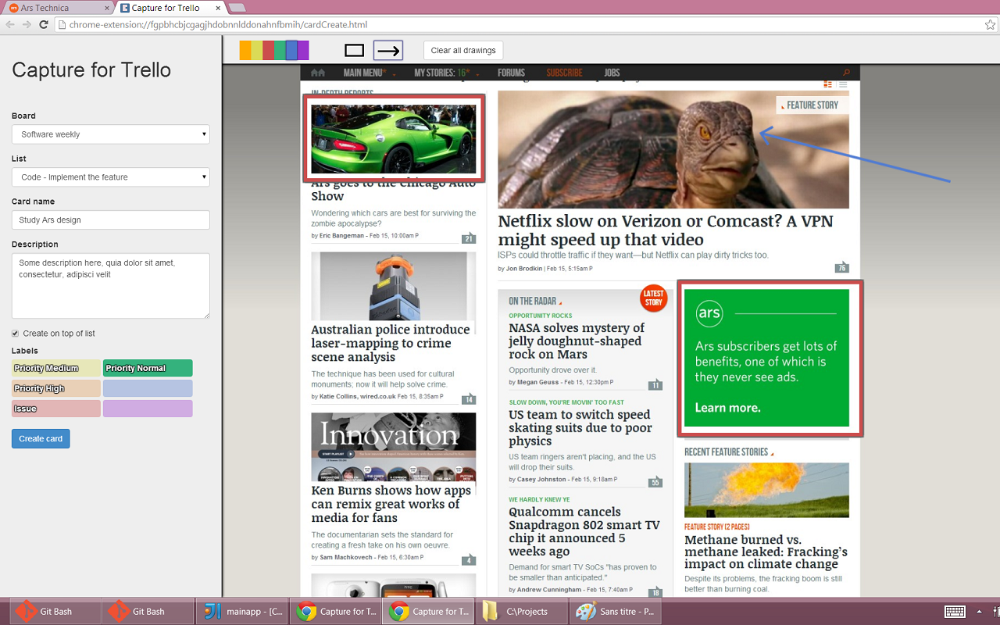

# Capture for Trello

Chrome extension that lets you take a screenshot of your web browser, draw arrows and rectangles over it and create a Trello card and attach the screenshot to it in literally two clicks. Bug reporting made easy.

<strong><a href="https://chrome.google.com/webstore/detail/trello-capture/kclmblojjeedhebmlokdjeiogppjkfih" target="_blank">Go get it from the Chrome Web Store</a></strong>

